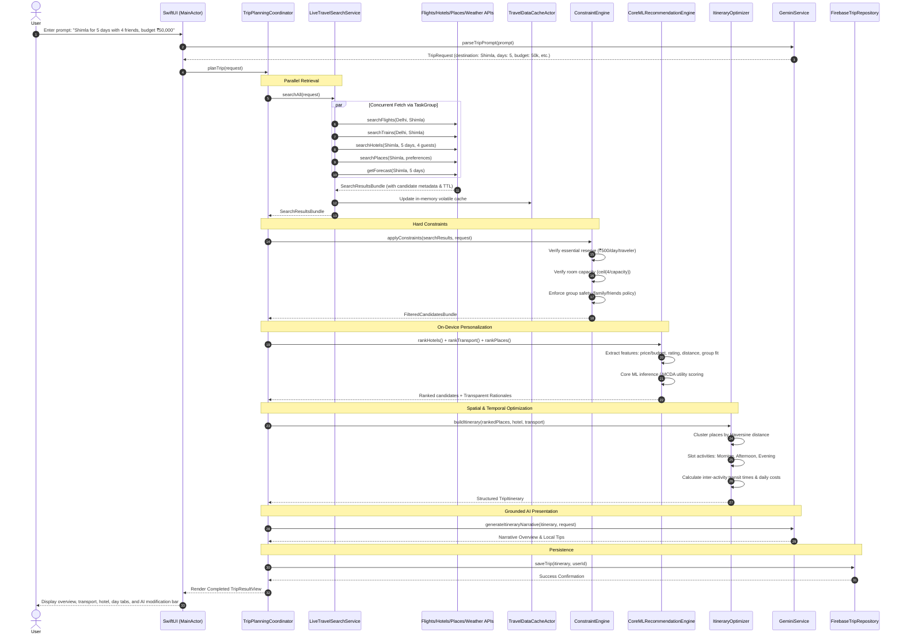

# Travel Partner — Hybrid AI Architecture & Technical Design

## 1. Executive Summary & Business Problem

Travel planning is a combinatorial optimization challenge under volatile conditions. When a traveler requests:

> *"I want to go to Shimla for 5 days with 4 friends. My total budget is ₹50,000. I want a round trip."*

Solving this problem requires reconciling deeply interdependent variables:
* **Budget Allocations**: Ensuring fixed accommodation and transit costs do not starve daily dining, entry fees, and local activities.
* **Volatile Real-World Data**: Flights, trains, hotel rooms, and ticket prices fluctuate continuously and cannot be treated as static database entries.
* **Physical & Spatial Constraints**: Attractions must be clustered geographically to minimize transit fatigue, while respecting strict venue opening/closing hours.
* **Group Dynamic & Safety Policies**: Families require verified family-friendly lodging; friend groups need multi-bed room capacity; solo travelers require heightened safety vetting.
* **Personalized Preferences**: Travelers have distinct appetites for nature, culture, adventure, relaxed pacing, and dietary restrictions.

### Why Generic LLM Chatbots Fail
Off-the-shelf LLM chat applications commonly fail in travel planning because:
1. **Hallucination of Volatile Facts**: LLMs fabricate non-existent flight routes, hallucinate outdated train schedules, and invent hotel room rates.
2. **Inability to Enforce Hard Constraints**: LLMs struggle with deterministic arithmetic, often recommending combinations that exceed the stated budget or violate room capacity laws.
3. **Privacy Exposure**: Sending entire personal preference graphs and continuous user interactions to cloud servers increases latency and compromises user privacy.

### The Solution: A 5-Layer Hybrid AI Recommendation Engine
Travel Partner resolves these challenges through a **Hybrid AI Architecture**:

```
┌────────────────────────────────────────────────────────────┐
│                    User Natural Prompt                     │
└─────────────────────────────┬──────────────────────────────┘
                              │
                              ▼
┌────────────────────────────────────────────────────────────┐
│ 1. Live Volatile Retrieval (Swift Structured Concurrency)  │
│    • Parallel queries: Flights, Trains, Hotels, Places,    │
│      Weather via TaskGroup                                 │
│    • Provenance metadata (source, timestamps, TTL)         │
└─────────────────────────────┬──────────────────────────────┘
                              │
                              ▼
┌────────────────────────────────────────────────────────────┐
│ 2. Hard Constraint Engine (Deterministic Business Rules)   │
│    • Zero ML / Zero LLM arithmetic guarantee               │
│    • Budget caps, room capacity, group safety filtering    │
└─────────────────────────────┬──────────────────────────────┘
                              │
                              ▼
┌────────────────────────────────────────────────────────────┐
│ 3. On-Device Personalization (Core ML / Local Ranking)     │
│    • Private on-device inference via MLModel               │
│    • Multi-Criteria Decision Analysis (MCDA) fallback      │
└─────────────────────────────┬──────────────────────────────┘
                              │
                              ▼
┌────────────────────────────────────────────────────────────┐
│ 4. Algorithmic Itinerary Optimizer (Spatial Clustering)    │
│    • Haversine distance clustering by day                  │
│    • Morning / Afternoon / Evening slot feasibility        │
└─────────────────────────────┬──────────────────────────────┘
                              │
                              ▼
┌────────────────────────────────────────────────────────────┐
│ 5. Grounded Generative AI (Google Gemini)                  │
│    • Natural-language synthesis and explanation            │
│    • Conversational modifications over candidate set       │
└─────────────────────────────┬──────────────────────────────┘
                              │
                              ▼
┌────────────────────────────────────────────────────────────┐
│ 6. Persistent State Layer (Google Firebase Firestore)      │
│    • Saved itineraries, user profiles, feedback signals   │
└────────────────────────────────────────────────────────────┘
```

---

## 2. Core Architectural Pillars

### Pillar A: Why On-Device ML (Core ML)?
* **Privacy-First Personalization**: The traveler's sensitive preferences (budget sensitivity, personal pacing, companion demographics) are computed strictly on-device. Raw preference vectors are never dispatched to external cloud endpoints merely to calculate a ranking score.
* **Three Dedicated On-Device Models**: The `CoreMLModelManager` manages three distinct Core ML regressors compiled on-device:
  1. `HotelRankingModel`: Evaluates budget consumption ratios, traveler ratings, distance to center, room capacity equations, and amenity profiles.
  2. `PlaceRankingModel`: Scores attractions against traveler interest vectors, group dynamic safety, time slots, and admission costs.
  3. `TransportRankingModel`: Analyzes duration trade-offs, transfer penalties, budget fractions, and travel mode preferences.
* **Feedback-Aware Ranking**: Incorporates user feedback signals from `FeedbackRepositoryProtocol` (`likedItemIds` / `dislikedItemIds`) to personalize future candidate scores.
* **Deterministic Fallback**: When model files are compiling or in unsupported environments, `CoreMLRecommendationEngine` seamlessly delegates to `DeterministicRankingEngine` (Multi-Criteria Decision Analysis utility scorer), ensuring zero crashes.
* **Explainability Without Score Leaks**: The ranking pipeline translates numeric ML scores into clear, human-readable explanations (`RecommendationRationale`), such as *"Core ML on-device rating: 92% group match"* and *"Accommodates all 4 friends across 2 rooms"*, rather than confusing users with raw probabilities.

### Pillar B: Why Firebase is Not the Source of Truth for Travel Data
A critical architectural pitfall is treating the application database as the authoritative provider of travel availability. 
* **Volatile Data**: Flights, hotel room availability, train waitlists, and hourly weather change constantly. They belong to the volatile domain with strict Time-To-Live (TTL) timestamps and revalidation contracts.
* **Firebase's True Role**: Firebase Firestore acts strictly as the **Application State & User Repository**. It persists:
  1. Authenticated User Profiles (`/users/{userId}`)
  2. Saved Itineraries and Trip History (`/users/{userId}/saved_trips/{tripId}`)
  3. Recommendation Feedback Signals (`/users/{userId}/feedback/{feedbackId}`)
* **Cache Invalidation**: While external search results can be temporarily cached in an in-memory actor (`TravelDataCacheActor`), cached results are explicitly flagged (`CandidateMetadata.isFresh`) and must be revalidated prior to critical user actions.

### Pillar C: Generative AI via Firebase AI SDK (Google Gemini)
Gemini is integrated via the official **Firebase AI SDK** (`FirebaseAI` / Firebase AI Logic) as a **reasoning and communicative interface** over structured candidates, rather than an unconstrained search engine:
* **Natural-Language Understanding (NLU)**: Parses unstructured free-form prompts (e.g. *"I want to go to Shimla for 5 days with 4 friends. Total budget is ₹50,000."*) into validated domain entities (`TripRequest`) using structured JSON generation schema (`GenerationConfig(responseMIMEType: "application/json")`).
* **Grounded Synthesis & Streaming**: When generating daily narratives and local tips, Gemini is supplied with strict JSON candidate payloads. System instructions prevent the model from inventing non-existent airlines, phantom trains, or unverified hotel discounts. Real-time streaming (`generateItineraryNarrativeStream`) provides responsive UI feedback.
* **Conversational Modifications**: When a user commands *"Make this cheaper"* or *"Switch to a scenic train"*, Gemini reasons over the genuine pre-filtered candidate pool (`candidatePool`) to recommend verified candidate IDs (`selectedHotelId`, `selectedTransportId`) rather than hallucinating lower prices.
* **Resilient Hybrid Facade (`HybridGeminiService`)**: Dynamically routes between the live Firebase AI SDK client (`FirebaseGeminiService`), direct REST API (`GeminiAPIService`), and an intelligent offline engine (`FallbackGeminiService`).

### Pillar D: Swift Concurrency & Data-Race Safety
Built in Swift 6 mode, the concurrency architecture enforces strict safety guarantees:
* **Structured Concurrency (`TaskGroup`)**: The live travel search service fires parallel asynchronous requests for flights, trains, hotels, attractions, and weather forecasts simultaneously, reducing search latency by up to 75% compared to sequential fetching.
* **Actor Isolation (`actor TravelDataCacheActor`, `actor LocalFirebaseEmulatedRepository`)**: Thread-safe in-memory caching and persistent state are isolated within actors to eliminate data races without manual lock management.
* **MainActor UI Isolation**: All ViewModels (`HomeViewModel`, `TripWizardViewModel`, `TripPlanningViewModel`, `TripResultViewModel`) are bound to `@MainActor`, ensuring UI state modifications occur safely on the main thread while intensive background parsing and clustering run on cooperatively scheduled worker threads.
* **Cancellation Tokens**: The pipeline checks `try Task.checkCancellation()` before and after every major step. If the user navigates away or launches a new search, the previous task graph cancels immediately.

---

## 3. Engineering Vocabulary & Pattern Glossary

| Term | Architectural Definition & Role in Travel Partner |
| :--- | :--- |
| **Structured Concurrency** | Concurrency paradigm where asynchronous task lifetimes are hierarchically bounded to parent scopes using `TaskGroup` and `async let`. |
| **Actor Isolation** | Swift language guarantee ensuring mutable actor properties can only be accessed sequentially, eliminating data races at compile time. |
| **Sendable** | Swift 6 type-system marker indicating that a type (`struct TripRequest`, `struct HotelCandidate`) can be safely passed across concurrent task boundaries. |
| **MainActor** | Global actor ensuring UI-bound state and `@Observable` view models execute exclusively on the application main thread. |
| **Dependency Injection** | Design pattern where services (`TravelSearchServiceProtocol`, `GeminiServiceProtocol`) are injected via initializers, enabling testability. |
| **Repository Pattern** | Mediates between the domain logic and data mapping layers (`TripRepositoryProtocol`), decoupling business logic from Firebase or local storage. |
| **Adapter Pattern** | Converts distinct external provider APIs (`FlightSearchProviderProtocol`, `HotelSearchProviderProtocol`) into standardized candidate models. |
| **Candidate Generation** | Step 1 of the recommendation system: retrieving a broad pool of plausible travel items from live search adapters. |
| **Candidate Filtering** | Step 2 of the recommendation system: applying hard deterministic business rules (capacity, budget, safety) to eliminate unviable candidates. |
| **Ranking Model** | Step 3 of the recommendation system: scoring surviving candidates using on-device Core ML or Multi-Criteria Decision Analysis (MCDA). |
| **Constraint Optimization** | Algorithmic scheduling of activities into daily time slots to minimize transit time (Haversine clustering) while respecting opening hours. |
| **Hybrid AI Architecture** | Synergistic combination of live deterministic APIs, on-device machine learning, and cloud generative AI. |
| **On-Device Inference** | Executing ML predictions locally using Apple's Core ML framework, preserving privacy and enabling offline operation. |
| **Cache vs Source of Truth**| Architectural boundary separating temporary volatile query caches (`TravelDataCacheActor`) from authoritative storage (`Firebase`). |
| **Partial Failure** | Fault-tolerant pattern where failure of a single search provider (e.g. flight API timeout) does not abort the entire planning pipeline. |
| **Graceful Degradation** | System resilience mechanism allowing the trip planner to substitute train options when flights fail, or offline NLU when Gemini is unconfigured. |
| **Cancellation** | Prompt cooperative termination of long-running asynchronous tasks when the user changes views or cancels a planning operation. |

---

## 4. End-to-End Pipeline Sequence Diagram



---

## 5. Security & Secret Management Architecture

### Absolute Separation of Code and Credentials
1. **Source Code Cleanliness**: No private keys, bearer tokens, or service account files are stored in git-tracked files.
2. **Template Provided**: `Configuration/Secrets.example` documents required environment variables and keys.
3. **Ignored Configuration**: `.gitignore` explicitly excludes:
   - `Secrets.plist`
   - `Secrets.xcconfig`
   - `Secrets.json`
   - `GoogleService-Info.plist`
4. **Hierarchical Runtime Resolution**:
   - `AppConfiguration.shared` checks:
     1. `ProcessInfo.processInfo.environment["GEMINI_API_KEY"]`
     2. Bundle file `Secrets.plist`
     3. User-entered key in **Settings > Gemini API Key** (masked in UI).
5. **Zero-Key Out-Of-The-Box Execution**:
   - Even if no API key is supplied, `FallbackGeminiService` automatically executes, allowing the app to parse prompts and generate trips deterministically.

---

## 6. Directory Structure & Dependency Injection Architecture

### Feature-Oriented Organization
The project structure strictly adheres to the principle of high cohesion within vertical feature domains and low coupling across horizontal infrastructure layers:

```text
TravelPartner/
├── App/                            # Application entry point, AppContainer & assets
├── Features/                       # Vertical feature slices
│   ├── Home/                       # Prompt entry, featured destinations
│   ├── TripPlanning/               # Wizard flow, live progress, result & components
│   ├── SavedTrips/                 # Trip library & Firestore persistence
│   └── Profile/                    # User preferences & API diagnostics
├── Domain/                         # Pure Foundation domain layer (zero SwiftUI imports)
│   ├── Models/                     # Pure data contracts (TripRequest, Candidates, Itinerary)
│   ├── Rules/                      # Deterministic rule evaluators (Budget, Group, Constraints)
│   └── Services/                   # Pure coordinator & optimizer algorithms
├── Data/                           # Network search and data persistence
│   ├── Remote/                     # Search providers, live search orchestrator, cache actor
│   └── Firebase/                   # Firestore repositories and local memory/disk emulator
├── AI/                             # AI & Machine Learning adapters
│   ├── Gemini/                     # Cloud generative AI service (NLU, synthesis, edits)
│   └── ML/                         # On-device Core ML ranking & MCDA fallback
├── Configuration/                  # Settings manager and git-ignored secrets templates
├── Shared/                         # Cross-cutting UI badges, views & error types
└── Tests/                          # Hermetic unit tests
```

### Dependency Injection with `AppContainer`
To avoid untestable global singletons, all major services are registered and wired inside `AppContainer`:
* `tripRepository`: `TripRepositoryProtocol` (defaults to `FirebaseTripRepository`)
* `userRepository`: `UserRepositoryProtocol` (defaults to `LocalFirebaseEmulatedRepository.shared`)
* `feedbackRepository`: `FeedbackRepositoryProtocol` (defaults to `LocalFirebaseEmulatedRepository.shared`)
* `travelSearchService`: `TravelSearchServiceProtocol` (defaults to `LiveTravelSearchService`)
* `constraintEngine`: `ConstraintEngineProtocol` (defaults to `ConstraintEngine`)
* `recommendationEngine`: `RecommendationEngineProtocol` (defaults to `CoreMLRecommendationEngine`)
* `itineraryOptimizer`: `ItineraryOptimizerProtocol` (defaults to `ItineraryOptimizer`)
* `geminiService`: `GeminiServiceProtocol` (defaults to `HybridGeminiService`)
* `tripPlanningService`: `TripPlanningCoordinator`

The container provides `AppContainer.shared` for production and `AppContainer.mock` for hermetic unit testing and Xcode SwiftUI previews.

