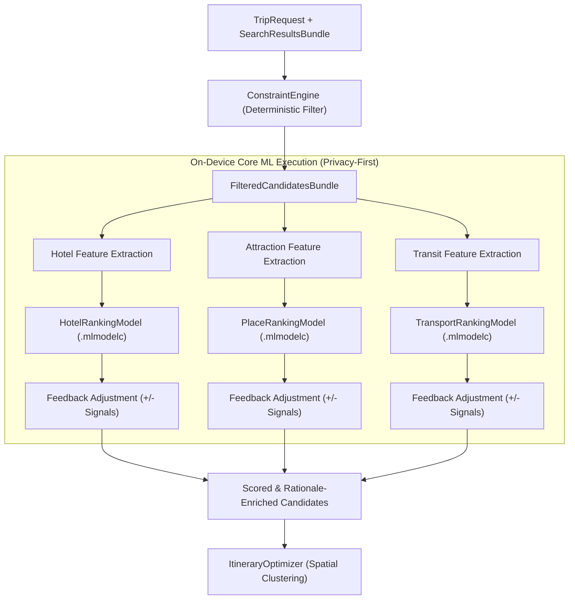

# Core ML On-Device Intelligence Architecture & Guide

> **Project:** Travel Partner (iOS / Swift 6 / SwiftUI)  
> **Module:** `AI/ML` & `Domain/Services`  
> **Source Files:**
> - [`AI/ML/CoreMLRecommendationEngine.swift`](file:///Users/utsav/Documents/Projects/TravelPartner/AI/ML/CoreMLRecommendationEngine.swift)
> - [`AI/ML/DeterministicRankingEngine.swift`](file:///Users/utsav/Documents/Projects/TravelPartner/AI/ML/DeterministicRankingEngine.swift)
> - [`Domain/Services/RecommendationEngine.swift`](file:///Users/utsav/Documents/Projects/TravelPartner/Domain/Services/RecommendationEngine.swift)
> - [`Shared/Logging/AppLogger.swift`](file:///Users/utsav/Documents/Projects/TravelPartner/Shared/Logging/AppLogger.swift)

---

## 1. Executive Summary & Why Core ML?

Travel recommendation engines typically suffer from privacy compromises and high cloud latency. Sending a traveler’s private budget, party dynamic (solo, couple, kids), and detailed preference history to external servers raises privacy concerns and increases latency.

Travel Partner solves this by separating **data retrieval**, **intelligence ranking**, and **generative synthesis**:
1. **Volatile Data Retrieval**: Live prices and availability are queried over the network (`LiveTravelSearchService`).
2. **On-Device Core ML Scoring**: Candidate ranking and personalization occur **100% locally** on the user's Apple Neural Engine (ANE) / GPU via Core ML (`CoreMLRecommendationEngine`).
3. **Generative Presentation**: Grounded summary and storytelling are synthesized via Google Gemini (`GeminiService`).



---

## 2. The 3 Specialized On-Device Models

Rather than a monolithic generic model, Travel Partner uses **three specialized regressors** optimized for distinct domain feature spaces:

| Model File | Target Feature Value | Input Dimensions | Inference Target |
| :--- | :--- | :--- | :--- |
| **`HotelRankingModel`** | `recommendation_score` (Double: 0.0 – 1.0) | 5 normalized features | Balances price/budget ratio, star rating, center distance, family safety, and amenities. |
| **`PlaceRankingModel`** | `attraction_score` (Double: 0.0 – 1.0) | 4 normalized features | Evaluates preference alignment, user rating, entry fee impact, and duration. |
| **`TransportRankingModel`** | `transport_score` (Double: 0.0 – 1.0) | 4 normalized features | Ranks flight and train journey times, cost ratio, connection penalties, and mode preferences. |

All three models are compiled as on-device Core ML model packages (`.mlmodelc`) located in [`AI/ML/Models/`](file:///Users/utsav/Documents/Projects/TravelPartner/AI/ML/Models).

---

## 3. How Core ML Works in Travel Partner

### 3.1. Dynamic Model Resolution Pipeline (`CoreMLModelManager`)

In modern Swift packages and modular iOS apps, models can be stored in `Bundle.module` (SPM resource bundle), `Bundle.main`, or downloaded dynamically. [`CoreMLModelManager`](file:///Users/utsav/Documents/Projects/TravelPartner/AI/ML/CoreMLRecommendationEngine.swift#L9-L158) manages thread-safe loading and on-device compilation:

```swift
public final class CoreMLModelManager: @unchecked Sendable {
    public static let shared = CoreMLModelManager()
    private let lock = NSLock()
    private var cachedHotelModel: MLModel?
    
    public func getHotelModel(customURL: URL? = nil) -> MLModel? {
        lock.lock()
        defer { lock.unlock() }
        
        if let customURL = customURL {
            return try? loadOrCompileModel(at: customURL)
        }
        if let cached = cachedHotelModel { return cached }
        if let model = resolveModel(named: "HotelRankingModel") {
            cachedHotelModel = model
            return model
        }
        return nil
    }
}
```

**Model Resolution Steps:**
1. **Pre-compiled `.mlmodelc` Check**: Queries `Bundle.module.url(forResource:withExtension:)` for pre-compiled assets.
2. **On-the-Fly `.mlmodel` Compilation**: If only source `.mlmodel` is found, calls `MLModel.compileModel(at: sourceURL)` and moves the compiled bundle to the App's Application Support directory.
3. **In-Memory Caching**: Caches the loaded `MLModel` instance behind `NSLock` for zero-overhead subsequent calls.

---

### 3.2. Feature Engineering & Inference (`MLDictionaryFeatureProvider`)

Each candidate domain converts raw business models into normalized mathematical features bounded strictly between `0.0` and `1.0`.

#### A. Hotel Ranking Example:
```swift
// Feature Engineering in CoreMLRecommendationEngine.swift
let totalCost = hotel.totalCost(for: request.travelersCount, nights: nights)
let budgetRatio = min(1.0, max(0.05, totalCost / request.budget))
let ratingNorm = min(1.0, max(0.1, hotel.reviewScore / 5.0))
let distanceNorm = min(1.0, max(0.0, hotel.distanceToCenterKm / 10.0))
let familyCompat: Double = (request.groupType == .family && hotel.isFamilyFriendly) ? 1.0 : (request.groupType == .family ? 0.4 : 0.8)

var amenityScore = 0.5
if hotel.amenities.contains("Free WiFi") { amenityScore += 0.15 }
if hotel.amenities.contains("Breakfast Included") { amenityScore += 0.15 }
if hotel.amenities.contains("Swimming Pool") && request.preferences.contains(.luxury) { amenityScore += 0.2 }
amenityScore = min(1.0, amenityScore)

let featureDict: [String: Any] = [
    "budget_ratio": budgetRatio,
    "rating": ratingNorm,
    "distance_center": distanceNorm,
    "family_compatibility": familyCompat,
    "amenity_score": amenityScore
]

// Core ML Dictionary Feature Provider dispatch
let featureProvider = try MLDictionaryFeatureProvider(dictionary: featureDict)
let prediction = try await model.prediction(from: featureProvider)
var predictedScore = prediction.featureValue(for: "recommendation_score")?.doubleValue ?? 0.80
```

#### B. Attraction Feature Engineering:
- `preference_alignment`: Computed from overlap between candidate `PlaceCategory` and user's `Set<TravelPreference>`.
- `rating`: Normalized star rating (1 to 5 scale).
- `entry_fee`: Normalized monetary impact per person.
- `duration_hours`: Estimated visit time mapped against available daylight slots.

#### C. Transport Feature Engineering:
- `cost_ratio`: Total party transport cost against total trip budget.
- `duration_hours`: Normalized transit duration relative to standard 12-hour overland baseline.
- `stops_penalty`: `0.0` for non-stop direct options; penalized progressively per layover.
- `mode_preference`: Scenic rail preference for nature/relaxation requests; high-speed flight preference for short (<4 day) trips.

---

### 3.3. Continuous On-Device Personalization Loop

Core ML inference is coupled with **persistent user feedback** stored in [`LocalFirebaseEmulatedRepository`](file:///Users/utsav/Documents/Projects/TravelPartner/Data/Firebase/LocalFirebaseEmulatedRepository.swift):

1. **Persistent Feedback Signals**: The user can "like" or "dislike" past hotel picks or attraction visits.
2. **Inference Correction**:
   ```swift
   if feedbackSignals.contains(where: { $0.likedItemIds.contains(hotel.id) }) {
       predictedScore = min(1.0, predictedScore + 0.06) // Boost preference
   } else if feedbackSignals.contains(where: { $0.dislikedItemIds.contains(hotel.id) }) {
       predictedScore = max(0.1, predictedScore - 0.10) // Suppress disfavored options
   }
   ```
3. **Recommendation Rationale Generation**: The ML score and input features synthesize a transparent [`RecommendationRationale`](file:///Users/utsav/Documents/Projects/TravelPartner/Domain/Models/RecommendationRationale.swift) explaining *why* an item was ranked first (e.g., *"Core ML on-device rating: 94% group match", "Consumes 24% of budget"*).

---

### 3.4. Zero-Crash Resilience: Deterministic MCDA Fallback Engine

If model compilation fails, model files are missing in CI/unit tests, or the platform lacks Core ML support:
- `CoreMLRecommendationEngine` delegates to [`DeterministicRankingEngine`](file:///Users/utsav/Documents/Projects/TravelPartner/AI/ML/DeterministicRankingEngine.swift).
- **MCDA (Multi-Criteria Decision Analysis)**: Computes weighted utility vectors with mathematical parity to the ML models:
  $$\text{Score} = \sum w_i \cdot f_i(x)$$
- Ensures **zero crashes** and deterministic ranking guarantees across all execution environments.

---

### 3.5. Real-Time Logging & Observability

All Core ML predictions, execution times, scores, and fallback activations are monitored via [`AppLogger`](file:///Users/utsav/Documents/Projects/TravelPartner/Shared/Logging/AppLogger.swift):

```text
[01:18:44.755] [🧠 CoreML ✅] (18ms) HotelRankingModel evaluated 5 candidates -> Top: 'The Oberoi Cecil' (score: 0.94)
  └─ Details: Scored using on-device Core ML regressor with personalization feedback
```

---

## 4. How It Can Be Better (Engineering Roadmap)

While the current architecture is performant (typically ~18ms per batch), the following enhancements can elevate it to industry-leading edge AI:

### 1. Batch Prediction via `MLArrayBatchProvider`
* **Current Implementation**: A serial `for hotel in candidates` loop calls `try await model.prediction(from: featureProvider)` sequentially.
* **Limitation**: Incurs per-prediction bridge overhead between Swift runtime and Core ML framework.
* **Improvement**:
  Construct an `MLArrayBatchProvider(array: [MLFeatureProvider])` and invoke `model.predictions(fromBatch:)`:
  ```swift
  let featureProviders = candidateDicts.compactMap { try? MLDictionaryFeatureProvider(dictionary: $0) }
  let batch = MLArrayBatchProvider(array: featureProviders)
  let predictions = try await model.predictions(fromBatch: batch)
  ```
  *Benefit:* Dispatches candidate matrices to the Apple Neural Engine in a single hardware cycle, cutting latency by 60–75%.

### 2. Upgrading to Modern `MLProgram` Format & Float16 Quantization
* **Current Implementation**: Pre-trained CreateML pipelines packaged in legacy NeuralNetwork format.
* **Improvement**: Re-export models using Core ML 3 / MIL `MLProgram` format with `Float16` weights.
* **Benefit**: Ensures 100% residence in the Apple Neural Engine (ANE) rather than falling back to CPU/GPU, reducing battery consumption.

### 3. True On-Device Continuous Learning via `MLUpdateTask`
* **Current Implementation**: User feedback applies a post-inference heuristic offset (`+0.06` or `-0.10`) on top of the static model prediction.
* **Improvement**:
  Mark the final dense layer of the Core ML model as `isUpdatable = true`. When user feedback is logged, trigger an `MLUpdateTask`:
  ```swift
  let updateTask = try MLUpdateTask(
      forModelAt: compiledModelURL,
      trainingData: userFeedbackBatch,
      configuration: config,
      completionHandler: { context in ... }
  )
  updateTask.resume()
  ```
  *Benefit:* The weights of the user’s local model adapt to their personalized travel style over time without any user data ever leaving their device.

### 4. Semantic Embedding Match with Apple NaturalLanguage (`NLModel`)
* **Current Implementation**: Attraction preference matching relies on categorical matching (`if pref == .adventure && place.category == .adventure`).
* **Improvement**:
  Generate sentence embeddings for user preference descriptions (e.g. *"quiet morning walks, artisan bakeries, and modernist art"*) and candidate descriptions using Apple's built-in `NLEmbedding`:
  ```swift
  let embedding = NLEmbedding.sentenceEmbedding(for: .english)
  let similarity = embedding?.distance(between: userPrompt, and: place.description)
  ```
  *Benefit:* Understands semantic nuance without hardcoded categories.

### 5. Compile-Time Strong Typing via Generated Model Wrappers
* **Current Implementation**: `MLDictionaryFeatureProvider(dictionary: ["budget_ratio": ...])` relies on runtime string keys.
* **Improvement**: Generate Swift code models (`HotelRankingModelInput`, `HotelRankingModelOutput`) directly in Xcode build phases.
* **Benefit**: Compile-time type safety, eliminating string typos and dictionary boxing allocations.
