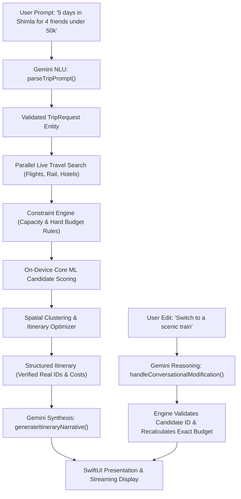
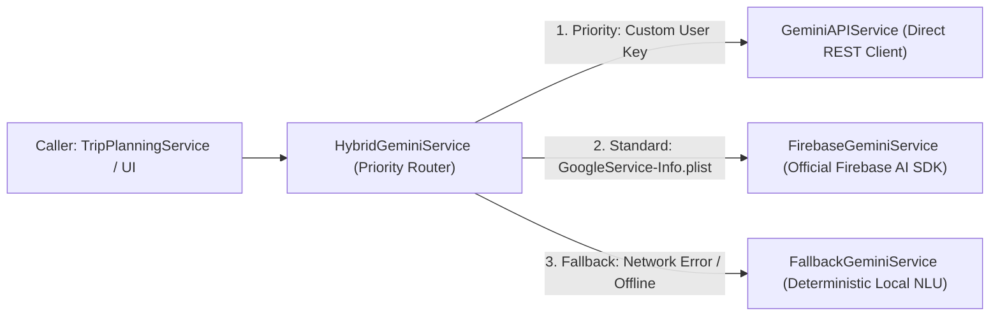

# Google Gemini AI Architecture, Input/Output Handling & Evolution Guide

> **Project:** Travel Partner (iOS / Swift 6 / SwiftUI)  
> **Module:** `AI/Gemini` & `Domain/Services`  
> **Source Files:**
> - [`AI/Gemini/GeminiService.swift`](file:///Users/utsav/Documents/Projects/TravelPartner/AI/Gemini/GeminiService.swift)
> - [`Domain/Services/TripPlanningService.swift`](file:///Users/utsav/Documents/Projects/TravelPartner/Domain/Services/TripPlanningService.swift)
> - [`Shared/Logging/AppLogger.swift`](file:///Users/utsav/Documents/Projects/TravelPartner/Shared/Logging/AppLogger.swift)
> - [`Features/Profile/ViewModels/ProfileViewModel.swift`](file:///Users/utsav/Documents/Projects/TravelPartner/Features/Profile/ViewModels/ProfileViewModel.swift)

---

## 1. Executive Summary: The Grounded AI Reasoning Paradigm

In traditional AI applications, developers frequently ask Large Language Models (LLMs) to perform tasks they are ill-suited for: calculating budgets, querying flight schedules, and booking hotel inventory. This causes **hallucinations**—invented flight numbers, impossible room rates, and phantom train routes.

Travel Partner eliminates hallucinations by adopting a **Grounded Reasoning Paradigm**:
- **Deterministic Services & Core ML** discover, filter, and score genuine live travel options (`LiveTravelSearchService` & `CoreMLRecommendationEngine`).
- **Google Gemini** acts as a **communicative and reasoning interface** over structured candidates. It extracts intent, synthesizes engaging daily narratives, and reasons over verified alternative candidate IDs.



---

## 2. Multi-Tiered Architecture & Resilient Routing

To guarantee zero crashes regardless of connectivity, API quotas, or authentication state, the Gemini layer is engineered as a **hybrid facade** across three independent engines:



| Service Class | Technology | When It Executes | Failure Recovery |
| :--- | :--- | :--- | :--- |
| **`FirebaseGeminiService`** | Official Google **Firebase AI SDK** (`FirebaseAI`) | Default production mode when Firebase credentials are configured. | Automatically delegates to `GeminiAPIService` or `FallbackGeminiService` on error. |
| **`GeminiAPIService`** | Direct REST client via `URLSession` | When user enters a personal Gemini API key in **Settings > Profile**. | Falls back to `FallbackGeminiService` if HTTP status $\ge 400$. |
| **`FallbackGeminiService`** | Offline Swift regex & template engine | Airplane mode, offline, rate-limited (HTTP 429), or missing API key. | 100% deterministic success; zero crash risk. |
| **`HybridGeminiService`** | Smart Facade | Top-level injection point used throughout the application. | Routes requests dynamically at runtime based on real-time health checks. |

---

## 3. The 3 Operational Pillars: Input & Output Contracts

### Pillar 1: Natural Language Understanding (`parseTripPrompt`)
Extracts unstructured user input into a validated domain model [`TripRequest`](file:///Users/utsav/Documents/Projects/TravelPartner/Domain/Models/TripRequest.swift).

#### Input Handling:
- **System Instruction**: Enforces output as raw JSON conforming to the domain schema:
  ```swift
  let systemPrompt = """
  You are a travel planning parser. Extract travel parameters from the user prompt into raw JSON with keys:
  - "destination" (string, capitalized name of destination city/region)
  - "origin" (string, default "Delhi" if unspecified)
  - "numberOfDays" (integer, positive number of days)
  - "travelersCount" (integer, positive number of people)
  - "groupType" (one of: "Solo", "Couple", "Friends", "Family", "Business")
  - "budget" (number, total budget)
  - "currency" (string: "INR", "USD", "EUR", "GBP", default "INR")
  - "tripType" (one of: "roundTrip", "oneWay")
  - "preferences" (array of strings from: "Nature", "Culture", "Adventure", "Foodie", "Shopping", "Luxury", "Budget-friendly", "Relaxation")
  Output ONLY valid JSON without markdown wrapping.
  """
  ```
- **Generation Configuration**:
  ```swift
  let config = GenerationConfig(
      temperature: 0.2, // Low temperature for high extraction fidelity
      responseMIMEType: "application/json"
  )
  ```

#### Output Handling & Sanitization:
1. **Markdown Stripping**: Strips potential LLM conversational wrapping (e.g. ```` ```json ... ``` ````).
2. **Type-Safe Decoding**: Deserializes JSON into Swift dictionaries, parsing integers, doubles, and string enums.
3. **Safety Fallback Values**: Injects boundary-safe defaults if fields are omitted (e.g., origin defaulting to `"Delhi"`, budget normalized to `>= 1000.0`).
4. **Validation**: Calls `request.validate()`, checking destination length and budget feasibility.

---

### Pillar 2: Grounded Narrative Synthesis & Real-Time Streaming (`generateItineraryNarrative`)
Synthesizes compelling, descriptive overviews tailored to traveler group dynamic and local atmosphere.

#### Input Payload Construction:
The model is **never** asked to imagine an itinerary. It is provided a structured summary of pre-selected, validated items:
```swift
private static func buildNarrativePrompt(for itinerary: TripItinerary, request: TripRequest) -> String {
    let hotelName = itinerary.selectedHotel?.name ?? "Central Hotel"
    let hotelScore = itinerary.selectedHotel.map { "rated \($0.reviewScore)/5.0" } ?? ""
    let transportTitle = itinerary.selectedTransportation?.title ?? "Express Transit"
    let transportMode = itinerary.selectedTransportation?.mode.rawValue ?? "Transit"
    let activitiesSummary = itinerary.days.flatMap { $0.activities }.prefix(6).map(\.place.name).joined(separator: ", ")

    return """
    Trip: \(request.numberOfDays) days to \(request.destination) from \(request.origin)
    Party: \(request.travelersCount) (\(request.groupType.rawValue) dynamic)
    Budget: \(request.currency) \(Int(request.budget)) (Planned spend: \(request.currency) \(Int(itinerary.totalEstimatedCost)))
    Transit: \(transportMode) - \(transportTitle)
    Stay: \(hotelName) (\(hotelScore))
    Highlights: \(activitiesSummary)
    """
}
```

#### Output Handling & Real-Time Streaming:
- **Streaming Execution**: Uses `model.generateContentStream(prompt)` wrapped in Swift’s `AsyncThrowingStream<String, Error>`.
- **Chunk Emission**: Emits partial markdown text chunks to SwiftUI views for low-latency visual feedback:
  ```swift
  for try await chunk in stream {
      if let text = chunk.text {
          continuation.yield(text)
      }
  }
  ```
- **Fallback Recovery**: If remote streaming drops midway (e.g., token exhaustion or connection dropped), the facade automatically switches to the offline deterministic template engine.

---

### Pillar 3: Grounded Conversational Modifications (`handleConversationalModification`)
Handles user voice/text commands such as: *"This hotel is too expensive"* or *"Switch to a scenic train"*.

#### Input Handling:
The model receives the user command along with a **Candidate Pool** of real alternatives with genuine UUIDs:
```text
User Request: "Switch to a scenic train ride."
Current Stay: ID: 88A7B631, Name: The Oberoi Cecil, Price/night: 7500
Current Transit: ID: 34262C46, Mode: flight, Title: Air India Express, Price: 4200

Available Alternative Transit:
ID: 7CD9EF47, Mode: train, Title: Kalka Shatabdi + Connecting Toy Train, Price: 850
ID: D0D1E637, Mode: train, Title: Himalayan Queen Express, Price: 620
```

#### Output Handling:
1. **JSON Action Protocol**:
   ```json
   {
     "action": "swapTransport",
     "selectedHotelId": null,
     "selectedTransportId": "7CD9EF47-DE02-4A42-AF6B-256DF290C890",
     "aiExplanation": "Updated transit to scenic railway route: Kalka Shatabdi Express + Connecting Toy Train. Enjoy relaxing valley vistas."
   }
   ```
2. **Deterministic Verification**:
   The engine does **not** trust LLM-generated prices. It extracts `selectedTransportId`, finds the exact candidate in `candidatePool.transportOptions`, replaces the candidate reference, and **recalculates the exact total trip budget in Swift**.

---

## 4. Observability: Real-Time Logging with `AppLogger`

All Gemini interactions are monitored and benchmarked in real time via [`AppLogger`](file:///Users/utsav/Documents/Projects/TravelPartner/Shared/Logging/AppLogger.swift):

```text
[01:18:44.717] [🌐 API ✅] (152ms) GET /flights?origin=Delhi&dest=Shimla -> 200 OK [Retrieved 3 flight candidate(s)]
[01:18:44.953] [✨ Gemini ✅] (620ms) [gemini-2.5-flash] generateItineraryNarrative 
  └─ Details: Prompt: "Itinerary narrative for Shimla"
  └─ Response: "Welcome to your tailored 5-day Shimla expedition! Curated specifically for 4 guests..."
[01:18:44.975] [⚡️ Pipeline ✅] Trip modified successfully: "Updated transit to scenic railway route: 'Kalka Shatabdi Express + Connecting Toy Train (12005)'."
```

---

## 5. How It Can Be Better (Engineering Roadmap)

While the current implementation guarantees zero hallucinations through grounding, the following architectural upgrades will improve latency, intelligence, and safety:

### 1. Engine-Level JSON Schema (`responseSchema`)
* **Current Implementation**: Enforces JSON formatting via natural-language system instructions and uses `responseMIMEType: "application/json"`.
* **Limitation**: LLMs can occasionally include unexpected keys, wrap in unwanted arrays, or format numbers as strings.
* **Improvement**:
  Use the Firebase AI SDK / Gemini Schema builder to enforce strict schema types directly in the generation config:
  ```swift
  let tripRequestSchema = Schema.object(
      properties: [
          "destination": Schema.string(),
          "numberOfDays": Schema.integer(),
          "budget": Schema.double(),
          "groupType": Schema.enumeration(values: ["Solo", "Couple", "Friends", "Family", "Business"])
      ],
      requiredProperties: ["destination", "numberOfDays", "budget", "groupType"]
  )
  
  let config = GenerationConfig(
      responseMIMEType: "application/json",
      responseSchema: tripRequestSchema
  )
  ```
  *Benefit:* 100% deterministic JSON structure directly from the inference engine; eliminates deserialization errors.

---

### 2. Native Tool Calling / Function Calling
* **Current Implementation**: The planning pipeline orchestrator executes searches first, and passes results to Gemini.
* **Improvement**:
  Equip Gemini with **function declarations** so it can interactively request live data as needed:
  ```swift
  let searchFlightsTool = FunctionDeclaration(
      name: "searchFlights",
      description: "Queries live available flight routes between origin and destination cities",
      parameters: ["origin": .string(), "destination": .string(), "date": .string()]
  )
  ```
  *Benefit:* Allows multi-turn reasoning where Gemini can autonomously decide when flights are impractical (e.g. short distance) and invoke rail search directly.

---

### 3. Model Baseline: Gemini 2.5 Flash
* **Current Implementation**: Configured with `gemini-2.5-flash` across `FirebaseGeminiService`, `GeminiAPIService`, and `HybridGeminiService`.
* **Rationale**: Older Gemini 1.5 endpoints were retired by Google Cloud (resulting in 404/403 errors). `gemini-2.5-flash` provides superior reasoning, reduced time-to-first-token, lower cost per million tokens, and stable streaming support.
* **Architecture**: Configured dynamically through `AppConfiguration.shared.geminiModelName` and overridable via constructor parameters.

---

### 4. Prompt Caching for Candidate Catalogs
* **Current Implementation**: Large candidate pools (hotels, transit lists, attractions) are serialized and re-sent in every prompt modification.
* **Improvement**:
  Leverage Google Gemini **Context Caching**:
  - Cache the destination catalog (e.g. 50 verified hotels and sights in Shimla) for 1 hour.
  - Conversational modification turns reference the cached token context using `cachedContent: cacheReference`.
  *Benefit:* Reduces input token pricing by up to **75%** and reduces conversational modification latency from ~1.2s to **<300ms**.

---

### 5. Multi-Turn Stateful `ChatSession`
* **Current Implementation**: Each edit builds a fresh prompt containing current selections.
* **Improvement**:
  Maintain a continuous `ChatSession` across the trip planning lifecycle:
  ```swift
  let chat = model.startChat(history: previousMessages)
  let response = try await chat.sendMessage("Make it cheaper")
  ```
  *Benefit:* Preserves context across multi-step conversational planning (e.g. *"Actually make it for 3 days"*, followed by *"Which hotel did you pick?"*).

---

### 6. Multi-Modal Visual Trip Ingestion
* **Improvement**:
  Allow users to upload screenshots of flight confirmations, Instagram travel reels, or hand-written itineraries.
  ```swift
  let imagePart = ModelContent.Part.data(mimetype: "image/jpeg", data: imageData)
  let response = try await model.generateContent([imagePart, "Convert this itinerary into a TripRequest"])
  ```
  *Benefit:* Instant trip import from screenshots, social media travel guides, and PDFs.
