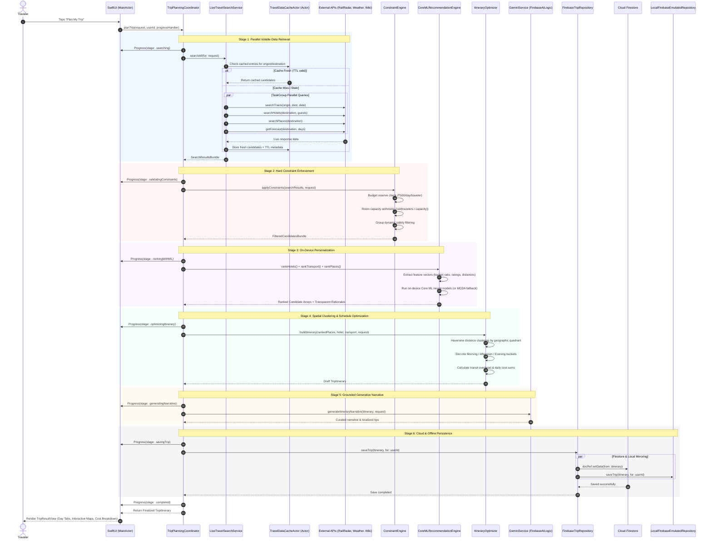
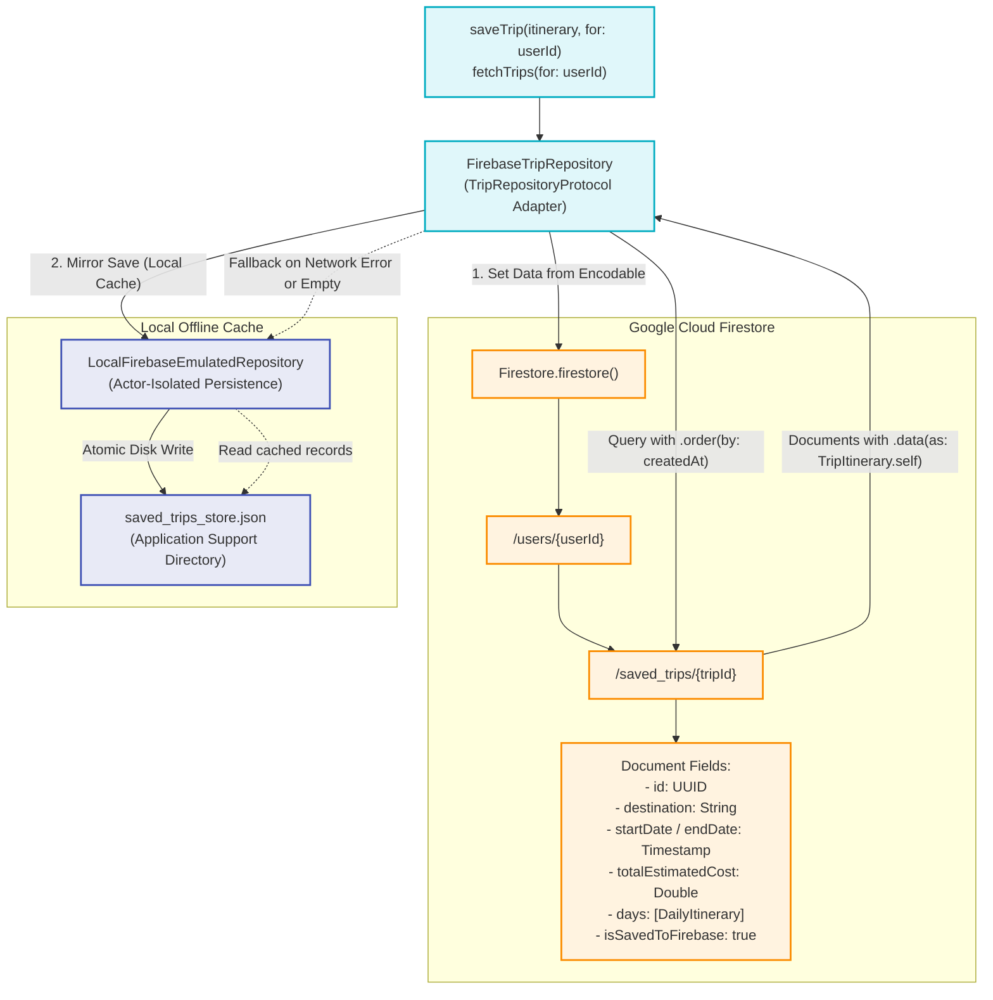

# TravelPartner System Design & Data Flow Architecture

This document maps out how data moves across all subsystems of the **TravelPartner** iOS application—from initial user intent parsing, through structured parallel live data retrieval, deterministic rule enforcement, on-device machine learning ranking, spatial/temporal optimization, grounded generative AI narrative synthesis, to Cloud Firestore persistence and local caching.

---

## 1. End-to-End System Data Flow Architecture

The diagram below illustrates the complete lifecycle of data as it travels across layers:

```mermaid
flowchart TD
    classDef ui fill:#E1F5FE,stroke:#0288D1,stroke-width:2px,color:#01579B;
    classDef coord fill:#E8F5E9,stroke:#388E3C,stroke-width:2px,color:#1B5E20;
    classDef network fill:#FFF3E0,stroke:#F57C00,stroke-width:2px,color:#E65100;
    classDef rules fill:#FCE4EC,stroke:#C2185B,stroke-width:2px,color:#880E4F;
    classDef ml fill:#EDE7F6,stroke:#7E57C2,stroke-width:2px,color:#4A148C;
    classDef opt fill:#E0F2F1,stroke:#00897B,stroke-width:2px,color:#004D40;
    classDef gemini fill:#FFF8E1,stroke:#FFA000,stroke-width:2px,color:#FF6F00;
    classDef storage fill:#ECEFF1,stroke:#546E7A,stroke-width:2px,color:#263238;

    subgraph UI ["Presentation Layer (SwiftUI / @MainActor)"]
        HomeUI["HomeView & HomeViewModel\n(Natural Prompt Input & Recent Trips)"]:::ui
        WizardUI["TripWizardView & TripWizardViewModel\n(4-Step Configuration Wizard)"]:::ui
        ProgressUI["PlanningProgressView & TripPlanningViewModel\n(Live 8-Stage Pipeline Tracker)"]:::ui
        ResultUI["TripResultView & TripResultViewModel\n(Interactive Itinerary, Map, & AI Bar)"]:::ui
        SavedTripsUI["SavedTripsView & SavedTripsViewModel\n(Cloud Firestore Trips & Search)"]:::ui
    end

    subgraph CoordinatorLayer ["Domain Orchestration"]
        Coordinator["TripPlanningCoordinator / TripPlanningService"]:::coord
        Container["AppContainer (Dependency Injection)"]:::coord
    end

    subgraph Stage1 ["Stage 1: Volatile Data Retrieval"]
        LiveSearch["LiveTravelSearchService (Structured Concurrency)"]:::network
        CacheActor["TravelDataCacheActor (In-Memory Actor)"]:::network
        RailRadar["RailRadarTrainSearchProvider (Live IRCTC Trains)"]:::network
        WeatherAPI["OpenWeatherProvider / OpenMeteo (Live Forecasts)"]:::network
        WikiPlaces["WikipediaPlaceSearchProvider (Sights & POIs)"]:::network
        DestCatalog["DestinationCatalog (Curated Hotels & Places)"]:::network
        MockProviders["MockTravelProviders (Fallback & Offline)"]:::network
    end

    subgraph Stage2 ["Stage 2: Deterministic Rule Filtering"]
        ConstraintEngine["TripConstraints Engine"]:::rules
        BudgetRules["BudgetRules (₹500/day reserve, stay & transit caps)"]:::rules
        GroupRules["GroupRules (Room allocations, family safety)"]:::rules
    end

    subgraph Stage3 ["Stage 3: On-Device Personalization"]
        RecEngine["RecommendationEngine"]:::ml
        CoreMLEngine["CoreMLRecommendationEngine (Neural On-Device Models)"]:::ml
        MCDAEngine["DeterministicRankingEngine (MCDA Utility Scoring Fallback)"]:::ml
        Rationales["RecommendationRationale Generator"]:::ml
    end

    subgraph Stage4 ["Stage 4: Spatial & Temporal Optimization"]
        Optimizer["ItineraryOptimizer"]:::opt
        Haversine["Haversine Distance Clustering"]:::opt
        TimeSlots["Slot Allocator (Morning / Afternoon / Evening)"]:::opt
    end

    subgraph Stage5 ["Stage 5: Grounded Generative AI"]
        GeminiService["GeminiService (FirebaseAILogic / REST)"]:::gemini
        NLUParser["NLU Prompt Parser -> TripRequest"]:::gemini
        NarrativeGen["Grounded Daily Itinerary Narrative & Local Tips"]:::gemini
        ModHandler["Conversational Modification Handler"]:::gemini
    end

    subgraph Stage6 ["Stage 6: Persistent Storage & State"]
        TripRepo["FirebaseTripRepository"]:::storage
        FirestoreDB[("Google Cloud Firestore\n/users/{userId}/saved_trips/{tripId}")]:::storage
        LocalEmulated[("LocalFirebaseEmulatedRepository\n(Disk JSON Cache)")]:::storage
    end

    %% Data Flow Connections
    HomeUI -->|"Natural text prompt"| NLUParser
    NLUParser -->|"Structured TripRequest"| HomeUI
    HomeUI -->|"Open wizard with parsed request"| WizardUI
    WizardUI -->|"Initiate planTrip(request, userId)"| ProgressUI
    ProgressUI --> Coordinator

    Coordinator -->|"1. Parallel Search via TaskGroup"| LiveSearch
    LiveSearch <-->|"Check TTL / Cache hits"| CacheActor
    LiveSearch -->|"Concurrent queries"| RailRadar & WeatherAPI & WikiPlaces & DestCatalog & MockProviders
    LiveSearch -->|"SearchResultsBundle (with CandidateMetadata)"| Coordinator

    Coordinator -->|"2. Validate Candidates"| ConstraintEngine
    ConstraintEngine --> BudgetRules & GroupRules
    ConstraintEngine -->|"FilteredCandidatesBundle (Zero hallucinated items)"| Coordinator

    Coordinator -->|"3. Score & Rank Surviving Pool"| RecEngine
    RecEngine --> CoreMLEngine
    CoreMLEngine -.->|"Fallback if uncompiled"| MCDAEngine
    RecEngine --> Rationales
    RecEngine -->|"Ranked Candidates + Rationales"| Coordinator

    Coordinator -->|"4. Build Schedule & Routes"| Optimizer
    Optimizer --> Haversine & TimeSlots
    Optimizer -->|"Cohesive TripItinerary (Draft)"| Coordinator

    Coordinator -->|"5. Synthesize Narrative"| GeminiService
    GeminiService --> NarrativeGen
    NarrativeGen -->|"TripItinerary with Gemini Narrative"| Coordinator

    Coordinator -->|"6. Save Trip"| TripRepo
    TripRepo -->|"Set Document Data"| FirestoreDB
    TripRepo -->|"Mirror Local Write (Offline Resilient)"| LocalEmulated
    TripRepo -->|"Saved confirmation"| Coordinator

    Coordinator -->|"7. Completed Pipeline"| ProgressVM
    ProgressVM -->|"Emit Finalized Itinerary"| ResultView
    ResultView <-->|"Load & Delete Trips"| SavedTripsView
    SavedTripsView <-->|"Fetch / Delete"| TripRepo
```

---

## 2. Asynchronous Execution & Concurrency Timeline

Data flows across specific execution domains and thread contexts to preserve smooth 60fps UI performance:

---

## 3. Conversational AI Modification Data Flow

When the user gives a follow-up modification prompt (e.g. *"Switch to a heritage hotel and make it 10% cheaper"*), data circulates without re-running the full 8-stage pipeline from scratch:

```mermaid
flowchart LR
    classDef input fill:#E3F2FD,stroke:#1E88E5,stroke-width:2px;
    classDef process fill:#FFF8E1,stroke:#FFA000,stroke-width:2px;
    classDef engine fill:#EDE7F6,stroke:#7E57C2,stroke-width:2px;
    classDef db fill:#ECEFF1,stroke:#607D8B,stroke-width:2px;

    UserInstruction["User Instruction:\n'Switch to a heritage hotel under ₹4000/night'"]:::input
    ResultVM["TripResultViewModel\n(State Owner)"]:::input
    SearchService["LiveTravelSearchService\n(Freshness Re-check)"]:::process
    ConstraintEngine["ConstraintEngine\n(Filter unviable options)"]:::process
    GeminiModifier["GeminiService\nhandleConversationalModification()"]:::engine
    UpdatedItinerary["Updated TripItinerary\n(New Hotel + Recalculated Costs)"]:::engine
    FirebaseRepo["FirebaseTripRepository\n(Sync to Firestore)"]:::db

    UserInstruction --> ResultVM
    ResultVM -->|"applyModification()"| SearchService
    SearchService -->|"Existing/Fresh Pool"| ConstraintEngine
    ConstraintEngine -->|"Candidate Pool"| GeminiModifier
    ResultVM -->|"Current Itinerary"| GeminiModifier
    GeminiModifier -->|"Picks matching genuine candidate ID"| UpdatedItinerary
    UpdatedItinerary -->|"Overwrites local state"| ResultVM
    UpdatedItinerary -->|"Persist update"| FirebaseRepo
    FirebaseRepo -->|"Update /users/{userId}/saved_trips/{id}"| db[("Cloud Firestore")]
```

---

## 4. Cloud Firestore & Local Offline Storage Architecture

Trips are stored with dual-write synchronization to ensure instant offline capability and seamless cloud syncing:

---

## 5. Subsystem Component Directory

| Subsystem | Primary Implementation | Responsibility |
| :--- | :--- | :--- |
| **Pipeline Coordinator** | [`TripPlanningCoordinator`](file:///Users/utsav/Documents/Projects/TravelPartner/Domain/Services/TripPlanningService.swift#L24-L245) | Orchestrates the 8-stage travel generation pipeline and conversational edits. |
| **Live Search Service** | [`LiveTravelSearchService`](file:///Users/utsav/Documents/Projects/TravelPartner/Data/Remote/LiveTravelSearchService.swift) | Queries external APIs concurrently via Swift `TaskGroup`. |
| **In-Memory Cache** | [`TravelDataCacheActor`](file:///Users/utsav/Documents/Projects/TravelPartner/Data/Remote/TravelDataCacheActor.swift) | Actor-isolated in-memory cache with TTL expiration to minimize API load. |
| **Constraint Engine** | [`TripConstraints`](file:///Users/utsav/Documents/Projects/TravelPartner/Domain/Rules/TripConstraints.swift) | Enforces deterministic budget rules ([`BudgetRules`](file:///Users/utsav/Documents/Projects/TravelPartner/Domain/Rules/BudgetRules.swift)) and group rules ([`GroupRules`](file:///Users/utsav/Documents/Projects/TravelPartner/Domain/Rules/GroupRules.swift)). |
| **Recommendation Engine** | [`RecommendationEngine`](file:///Users/utsav/Documents/Projects/TravelPartner/Domain/Services/RecommendationEngine.swift) | Coordinates on-device ML ranking ([`CoreMLRecommendationEngine`](file:///Users/utsav/Documents/Projects/TravelPartner/AI/ML/CoreMLRecommendationEngine.swift)) with MCDA fallback ([`DeterministicRankingEngine`](file:///Users/utsav/Documents/Projects/TravelPartner/AI/ML/DeterministicRankingEngine.swift)). |
| **Spatial Optimizer** | [`ItineraryOptimizer`](file:///Users/utsav/Documents/Projects/TravelPartner/Domain/Services/ItineraryOptimizer.swift) | Optimizes daily schedules by minimizing Haversine transit distance between POIs. |
| **Generative AI** | [`GeminiService`](file:///Users/utsav/Documents/Projects/TravelPartner/AI/Gemini/GeminiService.swift) | Generates grounded travel narratives and processes modifications using Google Gemini via `FirebaseAILogic`. |
| **Cloud Repository** | [`FirebaseTripRepository`](file:///Users/utsav/Documents/Projects/TravelPartner/Data/Firebase/FirebaseTripRepository.swift) | Persists and fetches itineraries in Google Cloud Firestore with offline fallback. |
| **Local Repository** | [`LocalFirebaseEmulatedRepository`](file:///Users/utsav/Documents/Projects/TravelPartner/Data/Firebase/LocalFirebaseEmulatedRepository.swift) | Thread-safe local JSON persistence actor for offline support and CI testing. |
| **Logging & Telemetry** | [`AppLogger`](file:///Users/utsav/Documents/Projects/TravelPartner/Shared/Logging/AppLogger.swift) | Unified structured logging across `api`, `pipeline`, `gemini`, `coreML`, and `general` categories. |
